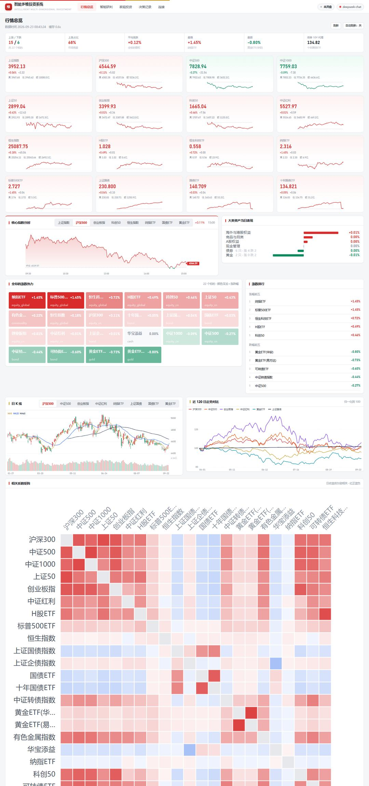
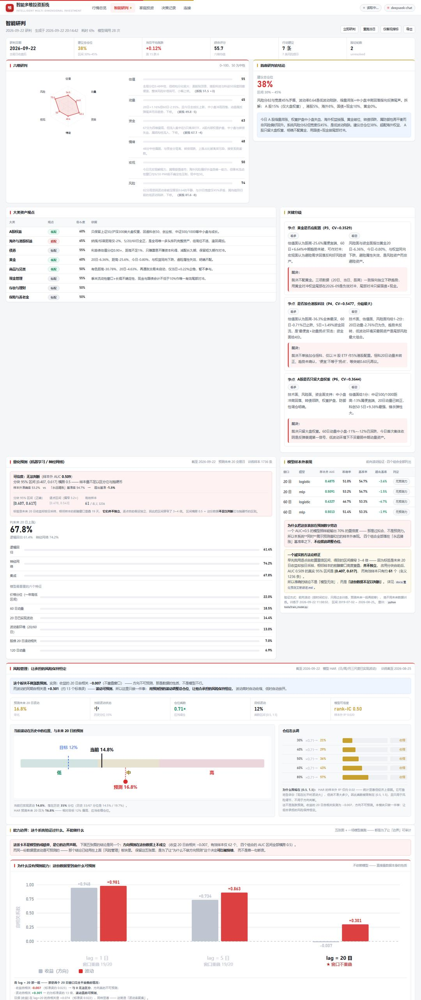
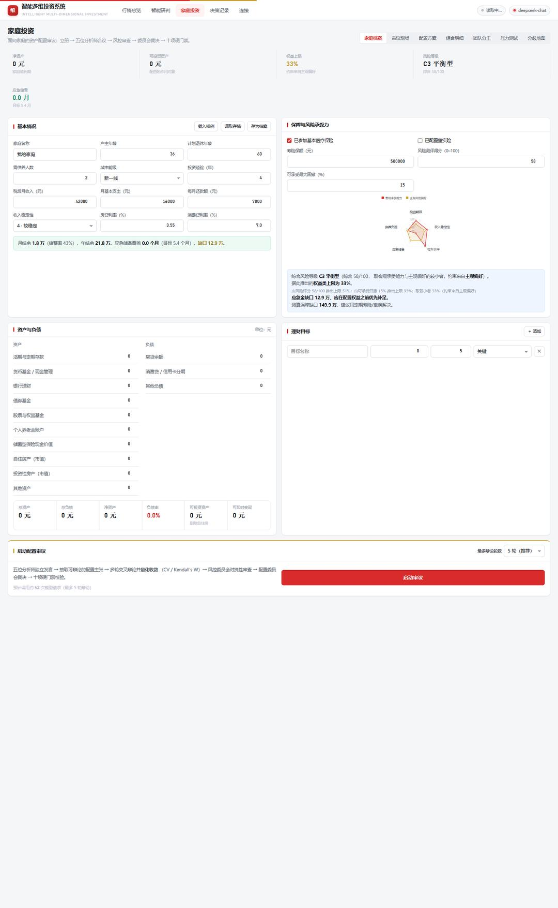
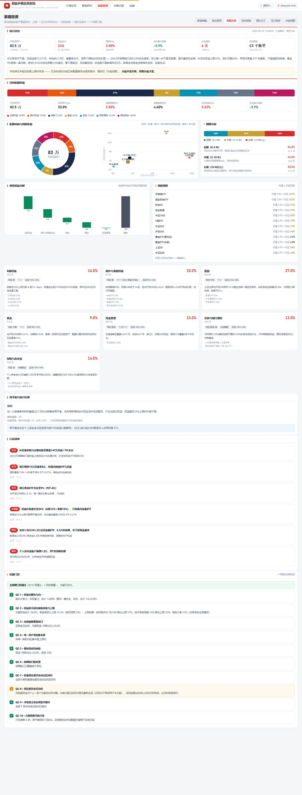
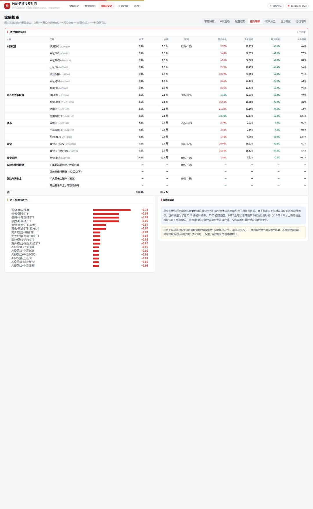
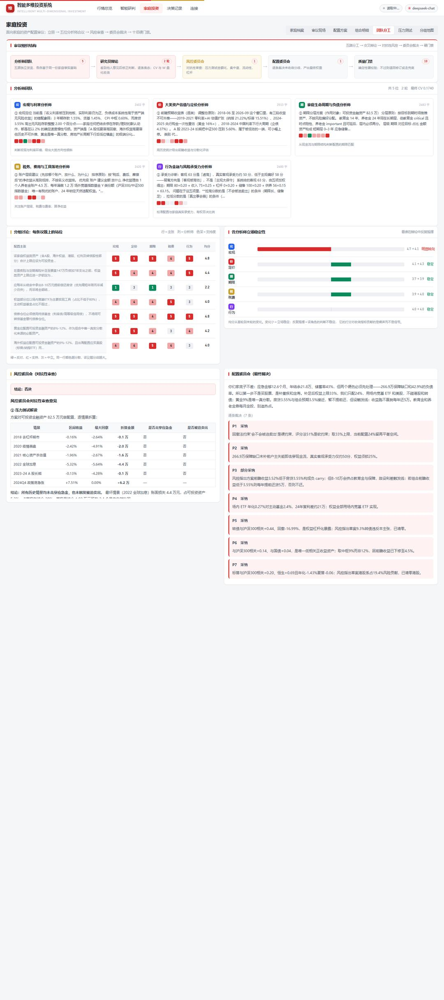
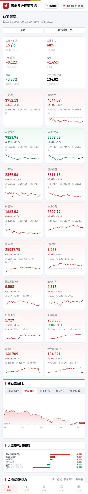
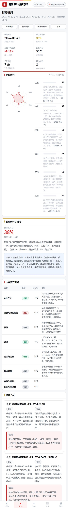
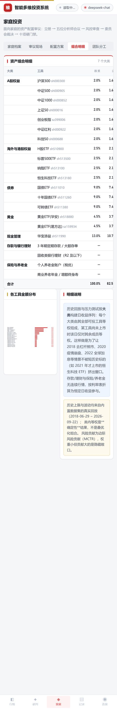
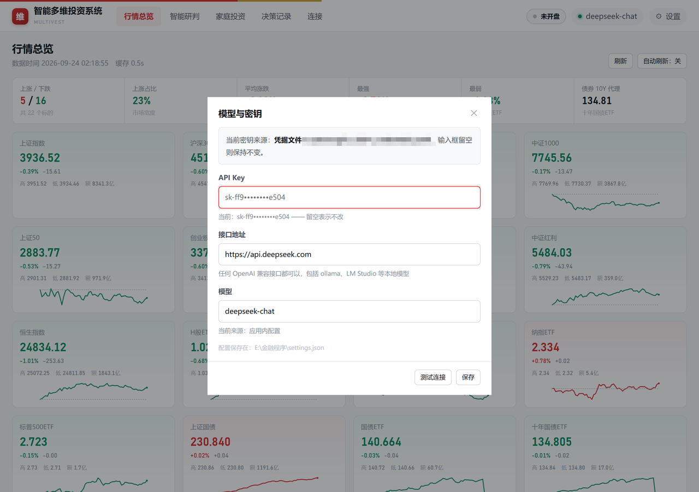

# Multivest · 智能多维投资系统 —— 多智能体量化投研会

<p align="center">
  <strong>简体中文</strong>
</p>

<p align="center">
  
  
  
  
  
  
</p>

<p align="left">
  <strong>🚀 开箱即用 · 开源免费 · 本地运行的家庭资产配置与每日行情研判工具</strong>
  <br>
  桌面应用，本地运行：真实行情数据 + 大语言模型 + 内置八年历史数据集。
  每交易日收盘后自动执行一次多智能体研判 —— 五位分析师独立发言、交叉辩论并作
  量化收敛判定、风控委员会对抗性审查、配置委员会逐条裁决，输出可审计的看板与建议。
  无需服务器与数据库，安装后直接运行；移动端可连接同一后端。
  <br>
  <br>
  <strong>❓ 它能帮你做什么</strong>
  <br>
  ① <b>告诉你每天该关注什么</b> —— 收盘后自动跑一场投研会，给出六维评分、
  大类资产观点、关键分歧、行动建议与风险清单；
  <br>
  ② <b>帮你把家庭的资产配置定下来</b> —— 填一次家庭档案，系统给出配置方案、
  组合明细、压力测试与再平衡纪律，并用十项硬门禁校验方案是否越界；
  <br>
  ③ <b>告诉你现在该拿多少仓位</b> —— 波动高时建议收缩、低时建议放宽，
  让组合承担的风险保持恒定。
  <br>
  <br>
  一次完整的每晚研判实测：<b>69 秒 · 28 次模型调用 · 22.7 万 token</b>，
  按 DeepSeek 公开定价（deepseek-flash 非高峰价）折合约 <b>¥0.2–0.3</b>。
</p>


## 🌐 相关项目

| 项目 | 说明 |
| --- | --- |
| [consensus-pipeline](https://github.com/fangqian616/consensus-pipeline) | 同作者的学术文献共识管线。本项目「CV + Kendall's W 量化收敛」这套机制的思想来源，但代码是重新实现的，两者不共享依赖。 |


<h2 align="center">✨ 核心功能与优势</h2>
<p align="center">
  <strong>多智能体投研会 · 家庭资产配置 · 每日行情研判 · 量化收敛 · 风险预算 · 结论先行</strong><br>
  <sub>每天的行情研判与家庭配置，一次装好，本地运行。</sub>
</p>

<table>
  <tr>
    <td width="33%" valign="top">
      <strong>🗣️ 每晚一场投研会</strong><br>
      五位分析师（技术面／资金面／宏观／估值／风险）独立发言 →
      交叉辩论并逐条表态 → 首席研判官产出看板。全过程实时可见。
    </td>
    <td width="33%" valign="top">
      <strong>📐 可测量的共识收敛</strong><br>
      辩论的终止不采用「意见一致即结束」的判定方式：Likert 1–5 表态 → <b>CV</b>（分歧度）与
      <b>Kendall's W</b>（排序一致性）双指标量化，达标即收敛，不达标走兜底轨道。
    </td>
    <td width="33%" valign="top">
      <strong>⚖️ 无法收敛就逐条裁决</strong><br>
      分歧不会消失，只会被藏起来。这里强制委员会对每条未收敛主张写出裁决与理由，
      显示在「分歧地图」上。<b>分歧不是失败，回避分歧才是。</b>
    </td>
  </tr>
  <tr>
    <td width="33%" valign="top">
      <strong>🔒 确定性指标由系统算</strong><br>
      六维里五维是纯代码计算的，模型只能做 ±15 的有界调整。
      一个每天跑的系统如果分数会漂移，用户就无法建立直觉。
    </td>
    <td width="33%" valign="top">
      <strong>🛡️ 十项确定性硬门禁</strong><br>
      权重和为 1、单类上限、权益不超过家庭承受力上限、风险资产占比、应急金充足性……
      全部是代码校验，不通过则退回修订或走兜底方案。
    </td>
    <td width="33%" valign="top">
      <strong>📉 波动目标化仓位</strong><br>
      已实现的是<b>波动率预测</b>（20 日自相关 +0.301，约 13 个标准误）与
      <b>波动目标化仓位</b>：用预测波动调整总仓位，使组合风险保持恒定。
      <b>量化预测部分仅参考，请务必谨慎用于投资决策。</b>
    </td>
  </tr>
  <tr>
    <td width="33%" valign="top">
      <strong>🧪 结论清晰</strong><br>
      每个建议都写清楚「为什么」与「触发条件」：什么情况下该调整、
      调整到什么位置。不用自己翻译指标，也不用判断模型是否可信。
    </td>
    <td width="33%" valign="top">
      <strong>📊 零依赖前端</strong><br>
      无构建步骤、无 CDN、无 npm。全部图表是手写内联 SVG（<code>charts.js</code>，13 个函数），
      设计系统只有红·白·金三色。
    </td>
    <td width="33%" valign="top">
      <strong>💻 本地优先</strong><br>
      数据落在本机，<b>不上传任何个人信息</b>。单文件桌面应用（42 MB），
      双击即用；手机扫码连同一后端。
    </td>
  </tr>
</table>


## 📸 界面预览

按使用流程排列。

### ① 行情总览 —— 每天打开第一眼

<a href="docs/screenshots/board.jpg"></a>

实时指数瓦片（带 60 日迷你走势与昨收基准线）、当日分时图（红绿分区）、
22 标的涨跌热力网格、K 线（含 MA 与成交量）、归一化走势对比、**22×22 相关系数热力图**。

### ② 智能研判 —— 每晚自动开一场投研会

<a href="docs/screenshots/daily.jpg"></a>

每天 20:30（可配）自动运行。产出六维评分、大类观点、关键分歧、行动建议与风险清单。
研判全程有实时进度条，卡住时会明确告知「连接可能已失联」并给出可操作出口。

### ③ 家庭投资 —— 从建档到组合明细

<table>
  <tr>
    <td width="50%" valign="top">
      <a href="docs/screenshots/family.jpg"></a>
      <sub><b>家庭档案</b> —— 资产负债表、现金流、目标、保障，以及风险承受力推导</sub>
    </td>
    <td width="50%" valign="top">
      <a href="docs/screenshots/plan.jpg"></a>
      <sub><b>配置方案</b> —— 执行总结、环形图、风险收益散点、期限阶梯、情景瀑布、风险预算、门禁</sub>
    </td>
  </tr>
  <tr>
    <td width="50%" valign="top">
      <a href="docs/screenshots/detail.jpg"></a>
      <sub><b>组合明细</b> —— 九列表格：大类 → 工具 → 权重 → 金额 → 区间 → 历史年化 → 波动 → 回撤 → 风险贡献</sub>
    </td>
    <td width="50%" valign="top">
      <a href="docs/screenshots/team.jpg"></a>
      <sub><b>团队分工</b> —— 组织结构、分析师角色卡、分组讨论矩阵、立场稳定性、逐条裁决</sub>
    </td>
  </tr>
</table>

### ④ 手机端

<p align="center">
  
  
  
</p>


## 📦 下载与使用

### ⬇️ 下载方式

| 方式 | 说明 |
| --- | --- |
| **源码** | `git clone https://github.com/fangqian616/multivest.git` |
| **快捷安装工具**（Windows） | 见 [Releases](https://github.com/fangqian616/multivest/releases) —— `Multivest-Setup-*.exe`，双击安装到用户目录，自动建快捷方式与卸载项，**无需管理员权限** |
| **单文件应用**（Windows） | 见 [Releases](https://github.com/fangqian616/multivest/releases) —— `multivest-*-windows-x64.exe`，约 42 MB，免安装双击即用 |
| **手机端**（Android） | 见 [Releases](https://github.com/fangqian616/multivest/releases) —— `Multivest-*.apk`，约 41 KB，连接电脑上运行的同一后端 |

### 🎬 使用方式

**① 装依赖**（源码运行）

```bash
pip install fastapi uvicorn requests qrcode pillow pywebview truststore
```

**② 配 API Key** —— 应用内直接填，不用改文件

首次启动时界面自动弹出配置窗口：填 Key（可一并改模型与接口地址）→ 点「测试连接」→ 保存即生效，无需重启。

<p align="center">
  
</p>

之后随时可改：点顶栏的 **⚙ 设置**，或点右上角的模型状态胶囊。

配置写入数据目录的 `settings.json`（非 Windows 下权限 600）。密钥只存在本地、不回传给前端、不入库；
界面上显示的是掩码形式（`sk-ab12••••••••cd34`）。

无图形界面的场景（服务器部署、纯命令行）仍可用 `.env` 或环境变量：

```bash
DEEPSEEK_API_KEY=sk-你的密钥
```

也可以放在 `~/.dsh/.credentials.yaml`。任何 OpenAI 兼容接口都支持，改 `DEEPSEEK_BASE_URL` 即可（包括 ollama / LM Studio 等本地模型）。

> **密钥解析优先级**：显式参数 → `settings.json`（界面写入）→ 环境变量 → `~/.dsh/.credentials.yaml`。
> 本机多套配置并存时，按此顺序取第一个命中的值。

**③ 跑起来**

```bash
python desktop.py            # 桌面窗口（推荐）
python backend/app.py        # 只起服务，浏览器访问 http://127.0.0.1:8760
```

或双击 `启动.bat`。

**④ 自检**

```bash
python tools/check_env.py      # 依赖 / 数据集 / API Key / 端口 / 局域网地址
python tools/test_offline.py   # 27 项离线断言（不调用 LLM）
python tools/train_model.py    # 训练量化模型并做前向滚动验证（约 3 分钟）
```

### 📱 手机连接

电脑上打开「连接」页 → 手机扫码 → **连的是同一个后端**（需同一 WiFi）。
打不开就检查：同一 WiFi？防火墙拦了 8760？服务绑的是 `0.0.0.0`？

### ⚙️ 环境变量

| 变量 | 默认 | 说明 |
| --- | --- | --- |
| `DEEPSEEK_API_KEY` | — | 大模型密钥（界面未配置时使用） |
| `DEEPSEEK_BASE_URL` | `https://api.deepseek.com` | 兼容其他 OpenAI 格式服务 |
| `MULTIVEST_DATA_DIR` | exe 同级 `智能多维数据/` | 数据落盘位置 |
| `MULTIVEST_NIGHTLY_AT` | `20:30` | 每晚研判时间 |
| `MULTIVEST_NIGHTLY_ENABLED` | `1` | 设为 `0` 关闭定时任务 |
| `MULTIVEST_INSECURE_SSL` | — | 仅内网自签证书时设为 `1`（会打警告） |


## 🛠️ 技术架构

<table>
  <tr>
    <td width="25%" valign="top"><b>后端</b><br>FastAPI + uvicorn<br>单进程，无数据库</td>
    <td width="25%" valign="top"><b>前端</b><br>原生 HTML/CSS/JS<br>零依赖、零构建</td>
    <td width="25%" valign="top"><b>桌面壳</b><br>pywebview (WebView2)<br>PyInstaller onefile</td>
    <td width="25%" valign="top"><b>数据</b><br>本地 JSON<br>内置 8 年 OHLCV</td>
  </tr>
</table>

### 🏗️ 项目结构

```
├─ backend/
│  ├─ app.py              HTTP 接口层
│  ├─ data/
│  │  ├─ market.py        数据集、大类序列、边际风险贡献（MCTR）
│  │  ├─ realtime.py      实时行情（TTL 缓存 + 降级回退）
│  │  └─ dataset/         内置数据（22 标的 × 2018-06~2026-09，OHLCV）
│  └─ engine/
│     ├─ nightly.py       每晚研判编排
│     ├─ debate.py        家庭配置审议（五路 + 风控 + 委员会 + 门禁）
│     ├─ stance.py        表态与收敛量化（CV / Kendall's W）
│     ├─ household.py     家庭档案与风险承受力推导
│     ├─ portfolio.py     权重生成、压力测试、再平衡
│     ├─ qc.py            十项确定性硬门禁
│     ├─ vol.py           波动率预测与波动目标化仓位
│     ├─ rv.py            波动率估计量
│     ├─ mcs.py           模型选型检验
│     ├─ risk.py          风险回测与绩效校正
│     ├─ alloc.py         组合构建与风险传导
│     ├─ statlib.py       统计工具
│     ├─ features.py      特征工程
│     ├─ quant.py         方向预测（保留作诊断）
│     └─ llm.py           大模型客户端
├─ android/               手机端应用
├─ frontend/              零依赖前端（无构建步骤、无 CDN）
├─ tools/                 构建、训练、自检、打包、发布
├─ docs/                  10 份设计文档 + 15 张截图
└─ desktop.py             桌面壳
```


## 🎯 量化层的设计取舍

系统的量化模块以**风险度量**为主，不提供涨跌方向预测。该取舍基于实测结果，
而非实现限制。

**收益方向未获数据支持。** 在不重叠的 20 日窗口上，收益的自相关系数为
**−0.007**，与 0 无法区分。机制上，可预测的收益会被套利交易消除：套利行为使
价格提前反映未来信息，从而消灭该可预测性本身。波动率不具备这一性质 —— 波动属于
风险而非收益机会，无法通过交易消除。同一口径下，波动的自相关系数为 **+0.301**，
约为标准误的 13 倍。

### 验证链路

量化层按「波动率怎么估 → 模型怎么选 → 风险输出准不准 → 组合怎么配」四步逐级验证，
每一步都有可复现的检验：

| 环节 | 做了什么 | 结果 |
| --- | --- | --- |
| **波动率估计** | 用上每日最高价与最低价，而不只是收盘价 | Yang-Zhang 估计量最优，样本外 R² **0.569 → 0.609** |
| **模型选型** | 六个候选模型同场比较，用模型置信集避免多重比较 | 90% 置信集 = **{HAR, HARQ}**；持续性基准、EWMA(0.94) 被淘汰 |
| **模型扩展** | 尝试两项文献中的改进 | HARQ 与 HAR **无显著差异**；跳跃分离 **显著更差** |
| **风险输出** | 用真实发生的损益回测 1% 亏损阈值 | 正态假设下 45 次击穿（超标）；换肥尾分布 **14 次（合格）** |
| **组合构建** | 收缩协方差 + 层次风险平价 | 条件数 718 → 354；年化波动 **20.5% → 17.4%** |
| **风险传导** | 度量各指数之间的风险流向 | 总溢出指数 **76%** —— 分散化空间有限 |

方法出处、公式与实现细节见 [量化层方法参考文献](docs/量化层方法参考文献.md)。

### 一条不成立的假设

波动目标化仓位常被引向 Moreira & Muir (2017) 的结论。本项目按同一口径做了预测回归，
实测 **β = 0.0216，t = 1.099，p = 0.272 —— 不显著**。

即波动目标化带来的收益无法归因于择时能力。反向证据同样列出：Cederburg 等 (2020)
在扩展样本上未能复现 Moreira-Muir 的结果；DeMiguel 等 (2024) 发现收益主要来自
**条件多因子组合**的构造，而非逐资产缩放。波动目标化在本系统中的定位因此是
**风险调节**，而非收益增强。

### 两项可验证的任务

<table>
  <tr>
    <td width="50%" valign="top">
      <strong>📐 判断过程的量化</strong><br>
      五位分析师的表态以 Likert 1–5 量表记录，据此计算 <b>CV</b>（分歧度）与
      <b>Kendall's W</b>（排序一致性）；两项指标同时达标方判定为收敛。
      未收敛的分歧由配置委员会逐条裁决，裁决理由强制记录并展示于「分歧地图」。
    </td>
    <td width="50%" valign="top">
      <strong>📉 风险的度量与调节</strong><br>
      以 HAR 模型预测未来 20 日波动率（样本外 rank-IC <b>0.83</b>），输出波动目标化
      仓位乘数：预测波动高于目标时收缩总仓位，低于目标时放宽，使组合的风险敞口
      保持恒定。
    </td>
  </tr>
</table>

> **本项目量化预测部分仅参考，请务必谨慎用于投资决策。**

**模型选型结论。** 在同一数据集上对六种候选模型进行前向滚动验证，三参数的
HAR 模型优于全部对照，包括神经网络与岭回归；在其基础上加入项目的 14 个特征后，
预测质量显著变差。在 86 个有效样本的条件下，**模型结构的正确性比模型的复杂度
更具决定性**。

> 样本外指标、分块自助置信区间、失败记录与方法论修正见
> [**量化预测文献综述**](docs/量化预测文献综述.md)。


## 📚 文档

| 文档 | 内容 |
| --- | --- |
| [**使用指南**](docs/使用指南.md) | **从这里开始**：从首次启动到问题排查的完整操作手册 |
| [量化预测文献综述](docs/量化预测文献综述.md) | 为什么不做方向预测、该用什么模型、完整路线图 |
| [测量效度与数据质量](docs/测量效度与数据质量.md) | **12 个真实缺陷及其修复**（含异常路径从未被执行的案例） |
| [架构设计](docs/架构设计.md) | 分层、数据流、端点清单、关键决策的理由 |
| [设计系统](docs/设计系统.md) | 红·白·金配色、信息密度手法、手机端处理 |
| [量化预测层](docs/量化预测层.md) | 第一次失败实验的完整记录与自我修正 |
| [与 TradingAgents 和 consensus-pipeline 的对照](docs/与%20TradingAgents%20和%20consensus-pipeline%20的对照.md) | 本项目架构的来源与差异 |
| [TradingAgents 论文评估](docs/TradingAgents论文评估.md) | 参考项目的复现性与效度审查 |
| [CHANGELOG](CHANGELOG.md) | 版本改动记录 |


## 🙋 联系方式

- **Issue**：[提交问题或建议](https://github.com/fangqian616/multivest/issues)
- 行情数据异常、模型行为异常、或文档中的错误，均可提交 issue


## Star History

<a href="https://star-history.com/#fangqian616/multivest&Date">
  
</a>


## ⚠️ 已知限制

以下四项尚未解决：

- **类内配置是等权**，不是最优化组合
- **回测引擎的正确性尚未验证** —— 分红除权、停牌、成分股变更的处理还没测过
- **未做 Barra 式收益归因**，无法区分收益来自 alpha 还是 beta
- 内置数据集为公开行情的历史快照，实时行情来自第三方公开接口，均不保证准确性

---

## 📄 许可证

[MIT](LICENSE)

---

## 免责声明

本项目是**研究与工程实践**，不是投资顾问。所有输出由大语言模型生成，不构成投资建议。
**本项目的量化预测部分仅参考，请务必谨慎用于投资决策。**

完整条款见 [DISCLAIMER.md](DISCLAIMER.md)。
